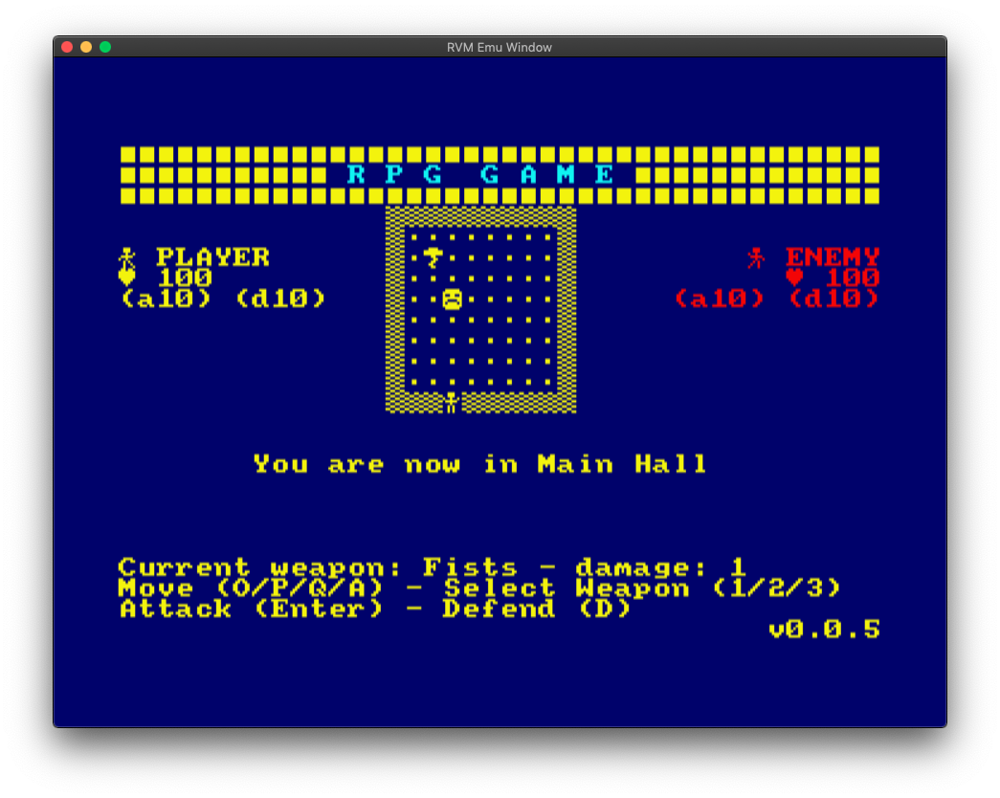
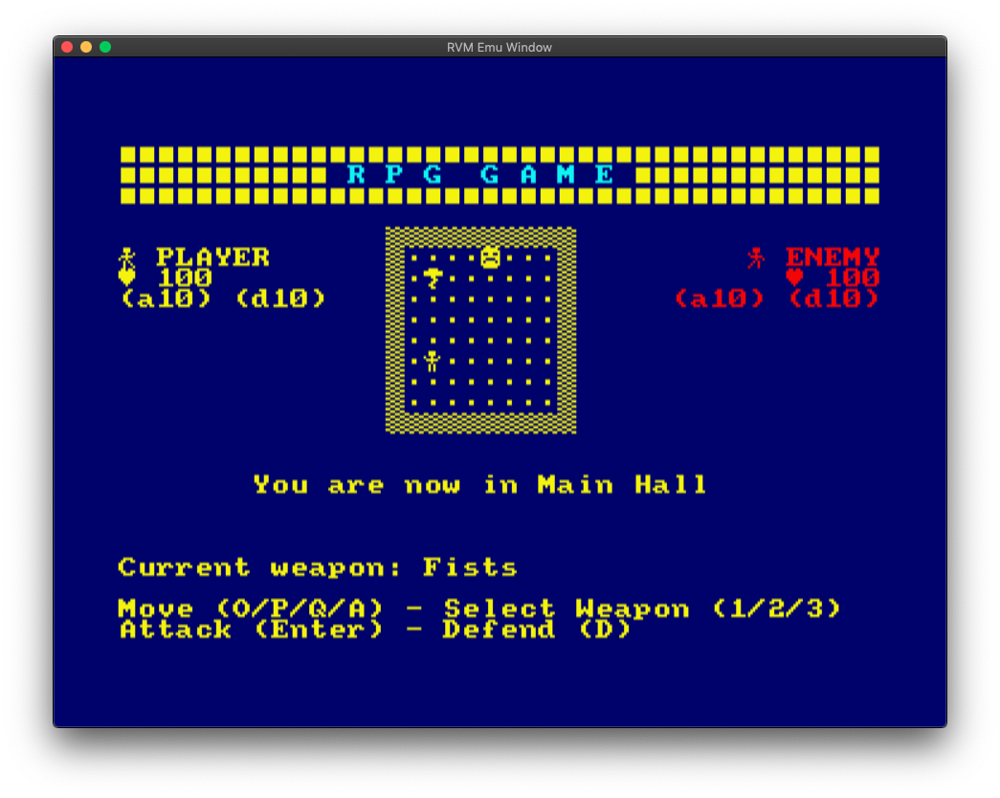
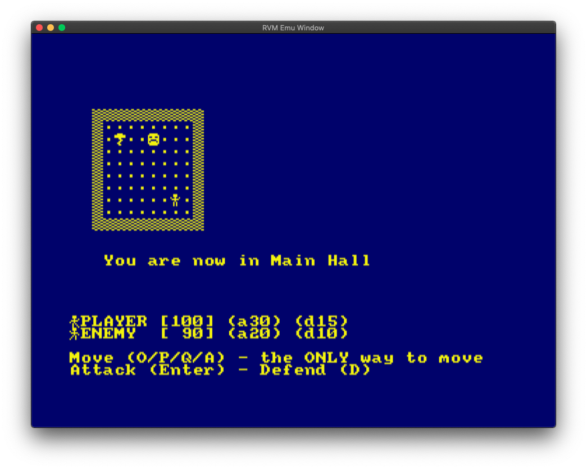
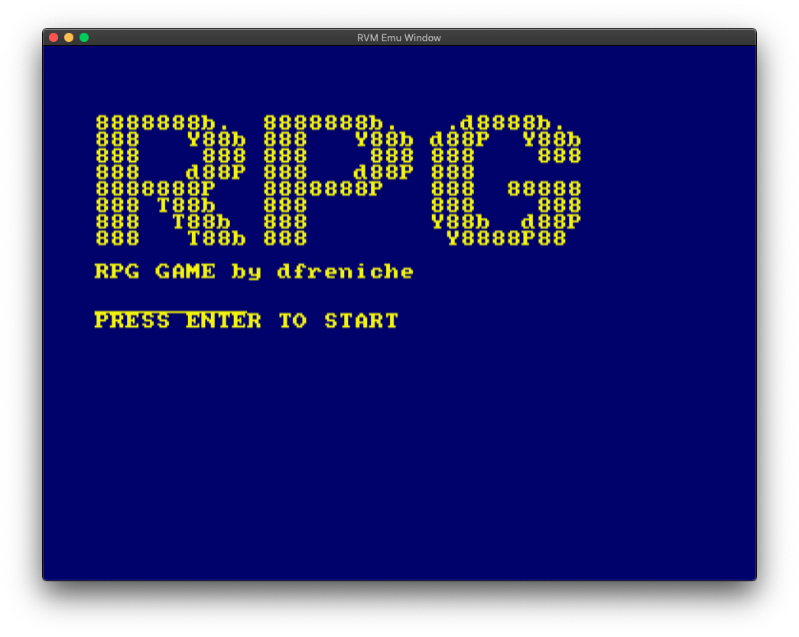
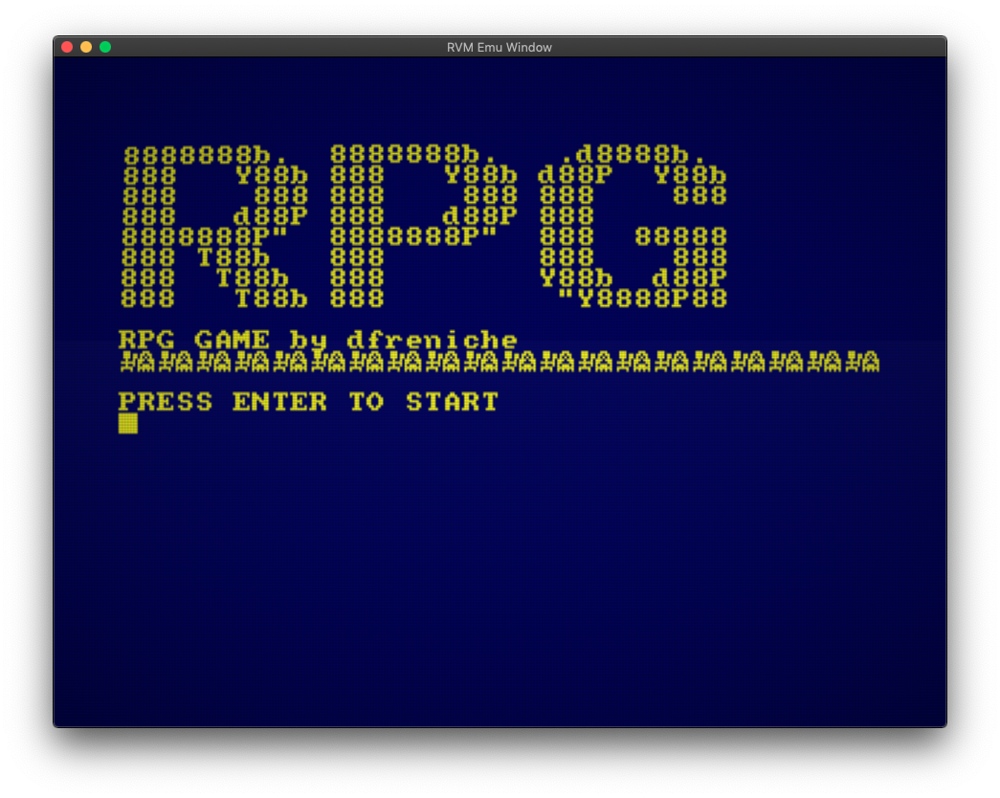

Disc Downloads (latest version)
=================

- 💾 C     - [Download](basic/c/rpg/rpg.dsk) 
- 💾 BASIC - [Download](basic/rpg.dsk) 

v0.0.6 (5/8/2019)
=================

- better overall presentation
- added monster attacks
- added console (WIP)

v0.0.5 (3/8/2019)
=================

Again worked just on the C version. The BASIC version is still at `v0.0.1`

## C Changes

- attack and defense works!
- end of game properly detected

v0.0.4 (3/8/2019)
=================

Again worked just on the C version. The BASIC version is still at `v0.0.1`

## C Changes

- prettier overal presentation
- added CHANGELOG and LICENSE files
- weapon selection now possible

v0.0.3 (2/8/2019)
=================

Worked just on the C version. The BASIC version is still at `v0.0.1`

## C Changes

- added monster movement
- improved screen rendering
- reorganized code

C Version v0.0.3 screenshot 📸

## BASIC Changes

- Nothing 🤦‍♂️

v0.0.2 (31/7/2019)
==================

## BASIC Changes
- added original `.bas` file along with version without comments

## C Changes
- added C version

v0.0.1 (30/7/2019)
==================

## BASIC Changes
- first version

## C Changes

- nothing done so far