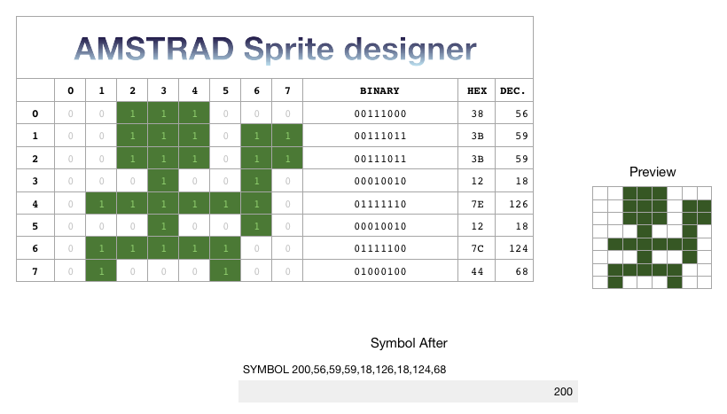

# RPG / Rogue like adventure game for the AMSTRAD CPC

This is part of the [AmstradGameDevChallenge](https://github.com/AmstradGameDevChallenge). The idea is to develop the same game in BASIC and C.

## The game

You're in a room, with a monster lurking nearby. You can move around, pick weapons, and figth the monster.

## Can I just try the game?

Yep, grab latest disc images here:

- 💾 C     - [Download](basic/c/rpg/rpg.dsk) 
- 💾 BASIC - [Download](basic/rpg.dsk) 

## TO-DO list (ordered by priority)

- [ ] feature parity C/BASIC. Will focus on C development and then try to emulate the same in BASIC.
- [ ] add back start screen to the C game
- [ ] add fight phase only when close to the monster
- [ ] weapon picking
- [x] weapon selection
- [ ] killing monsters gives xp points
- [ ] add XP levels
- [ ] add more rooms, and doors to connect rooms
- [ ] add some sound effects
- [ ] add some music. Don't know how and don't have any music. Help welcome!
 

## Dev environment used

- CPCTelera v1.5
- macOS Mojave 10.14.5
- Retro Virtual Machine 2

## Compiling

You need to install the prerequisites:

- [CPCTelera v1.5 installation instructions](http://lronaldo.github.io/cpctelera/files/readme-txt.html#Installing_CPCtelera)
- [Retro Virtual Machine 2](http://www.retrovirtualmachine.org/en/)
- unix2dos to convert UNIX CR/LF into AMSTRAD CR/LF. Install with Homebrew using `brew install unix2dos`

### BASIC game

No, BASIC is not compiled. But you still need to put the `.bas` file in a disc image and launch the emulator. To do this (and some more) you have the script `basic/make.sh

### C game

You need to have CPCTelera already set up in order to compile.

Once done. run `c/rpg/make.sh`

## Interesting docs found along the way

- [Disassembly of Locomotive BASIC v1.1](http://www.cpctech.org.uk/docs/basic.asm)
- 

## Utilities

- In `util` I've created a spreadsheet to design AMSTRAD CPC characters. It works perfectly in iPad and Mac. It's exported to Excel format, not working as nice as the other version. If anyone comes up with an improved version, please share. I design sprites in my iPad 😉

